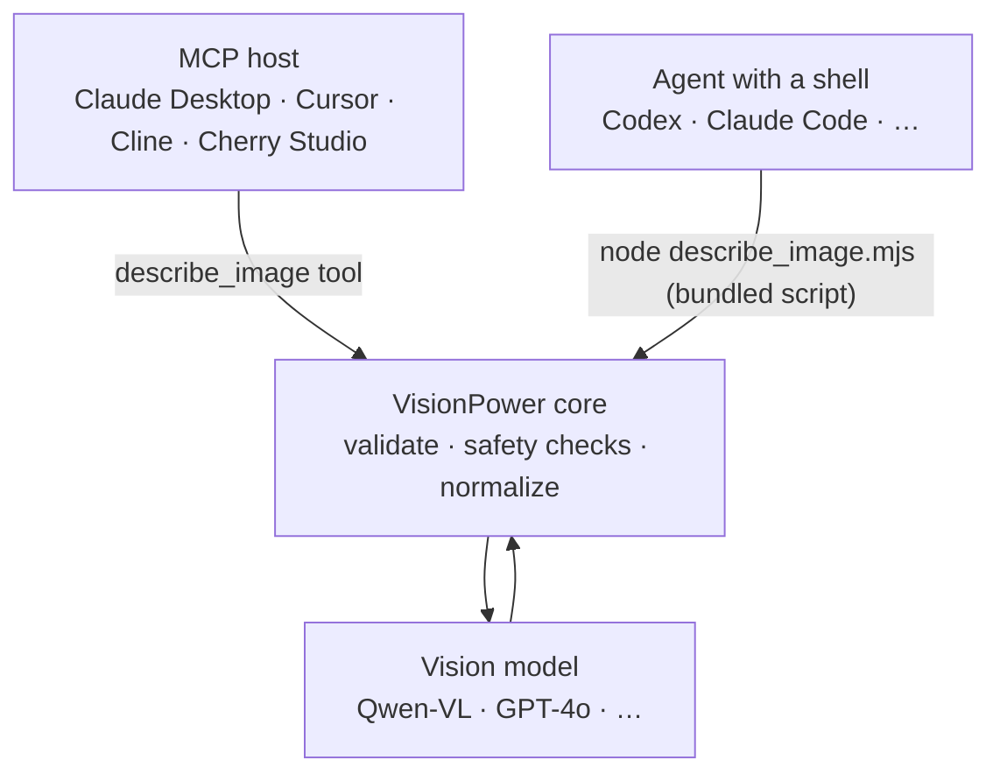

<div align="center">

# 👁️ VisionPower

**Give your AI agent eyes — a lightweight, secure, plug-and-play image-understanding capability, available as both an MCP server and a Skill.**

[](./README.md)
[](https://www.npmjs.com/package/visionpower)
[](./LICENSE)
[](https://nodejs.org)

</div>

VisionPower gives Codex, Claude Desktop, Cursor, Cline, Cherry Studio, and other agents the ability to **understand image content, read screenshot text (OCR), interpret charts, and analyze multiple images in order**.

It is **not tied to any single model**: it defaults to Qwen-VL via Alibaba Cloud Model Studio / DashScope's OpenAI-compatible endpoint, and you can switch to GPT-4o or any provider that supports OpenAI `/chat/completions` vision input by configuring the model name and base URL. The same core ships in **two forms** — [MCP](#use-as-an-mcp-server) and [Skill](#use-as-a-skill) — pick either or install both.

---

## ✨ Features

- 🧩 **One capability, two forms** — the same core works as the MCP tool `describe_image` or as a self-contained Skill (one zero-dependency script, download and run).
- 🖼️ **Four input sources** — local `image_path`, public `image_url`, `image_base64`, and an ordered `images[]` array.
- 🔢 **Ordered multi-image analysis** — auto-labels images as `Image 1 / Image 2 / …` and asks the model to answer in the same order.
- 🔌 **Model-agnostic** — any OpenAI-compatible vision provider; switch by changing two env vars.
- 🔒 **Security first** — path allowlist, file magic-byte verification, private/SSRF guard, strict base64 and input schema validation. See [Security](#-security-by-design).
- 🔁 **Resilient** — automatic retries on upstream throttling / 5xx / network blips (exponential backoff), with a timeout that also covers reading the response body so requests never hang.
- 🪶 **Minimal dependencies** — only the official MCP SDK and zod at runtime; no native modules, no image libraries.
- 🌐 **China-friendly** — built-in npmmirror and local-install paths for unreliable networks.

---

## 🎬 What It Can Do

Hand an image to your agent and let it analyze it:

**Input**

```json
{
  "image_path": "/Users/me/Desktop/dashboard.png",
  "prompt": "Read the key numbers in this screenshot and summarize the trend."
}
```

**Output (example)**

```text
This is a sales dashboard screenshot. The top KPIs show this month's GMV at ¥1,284,500
(+12.3% MoM) and 8,420 orders (+4.1% MoM). The center line chart shows a steady rise over
the last 6 months with a notable dip in March. The pie chart on the right shows East China
as the largest share (38%), followed by South China (25%)...
```

> 📸 Reading screenshots, 🧾 receipt/table extraction, 📊 chart interpretation, 🧭 UI walkthroughs, 🐞 diagnosing error screenshots — any "let the agent take a look" scenario fits.

---

## 🧭 Which Form To Choose

The two forms are **functionally equivalent** — they differ only in how the agent reaches them. Choose by your agent's capabilities:

| Your agent | Pick | Why |
| --- | --- | --- |
| Claude Desktop, Cursor, Cline, Cherry Studio (MCP, maybe no code execution) | **[MCP](#use-as-an-mcp-server)** | Exposes the structured `describe_image` tool with schema-validated, deterministic calls |
| Codex, Claude Code, and other agents **with a shell / code execution** | **[Skill](#use-as-a-skill)** | Runs its own zero-dependency script — no install, no long-running process |
| Pure chat MCP hosts with no code execution | **MCP** | The Skill form has nothing to run its script |

> You can **install both**. For an agent like Codex that has both MCP and a shell, either works.

---

## Use as an MCP server

### Fastest path: let your agent install it

Copy the prompt below and send it to your agent (swap in your API key):

```text
Please install and configure VisionPower MCP for me.

My vision model API key is: your-api-key
Use this model: qwen3-vl-flash
Use this base URL: https://dashscope.aliyuncs.com/compatible-mode/v1

If the official npm registry is stable in this environment, use:
npx -y visionpower

If access to the official npm registry is unstable, or this environment is on a mainland China network, prefer:
npx -y --registry=https://registry.npmmirror.com visionpower

If npx startup seems unstable, first run:
npm install -g visionpower --registry=https://registry.npmmirror.com
Then configure the MCP command as visionpower.

Please write the MCP configuration in the format required by the current agent and confirm that the describe_image tool is available.
```

**Requirements**: Node.js 18+ and a vision-capable OpenAI-compatible API key (Alibaba Cloud Model Studio key: <https://bailian.console.aliyun.com/?tab=model#/api-key>).

### MCP JSON config

For tools that configure MCP servers with JSON, such as Claude Desktop, Cursor, Cline, and Cherry Studio.

```json
{
  "mcpServers": {
    "visionpower": {
      "command": "npx",
      "args": ["-y", "visionpower"],
      "env": {
        "VISIONPOWER_API_KEY": "your-api-key",
        "VISIONPOWER_MODEL": "qwen3-vl-flash",
        "VISIONPOWER_BASE_URL": "https://dashscope.aliyuncs.com/compatible-mode/v1"
      }
    }
  }
}
```

<details>
<summary><b>🇨🇳 Mainland China npm mirror (recommended for unreliable networks)</b></summary>

Point `args` at npmmirror:

```json
"args": ["-y", "--registry=https://registry.npmmirror.com", "visionpower"]
```

</details>

### Codex TOML config

Codex uses TOML instead of JSON. Add this to `~/.codex/config.toml`:

```toml
[mcp_servers."visionpower"]
type = "stdio"
command = "npx"
args = ["-y", "visionpower"]

[mcp_servers."visionpower".env]
VISIONPOWER_API_KEY = "your-api-key"
VISIONPOWER_MODEL = "qwen3-vl-flash"
VISIONPOWER_BASE_URL = "https://dashscope.aliyuncs.com/compatible-mode/v1"
```

> For the China mirror, change `args` to `["-y", "--registry=https://registry.npmmirror.com", "visionpower"]`.

<details>
<summary><b>Install globally first (most stable for unreliable networks / long-term use)</b></summary>

```bash
npm install -g visionpower   # add --registry=https://registry.npmmirror.com in China
```

Then set `command` to the local `visionpower` (`args: []`). If a GUI app (Claude Desktop / Cursor) cannot find it, run `which visionpower` for the absolute path and use that as `command`.

</details>

---

## Use as a Skill

The Skill form is a **self-contained, zero-install, zero-dependency** folder, [`VisionPower-Skill/`](./VisionPower-Skill): it holds `SKILL.md` and a script `describe_image.mjs` that runs with plain Node. **No CLI to install, no `npm install`** — download this one folder and it works; all it needs is Node 18+ and an API key. Ideal for agents **with code execution** such as Codex and Claude Code.

> The folder is named `VisionPower-Skill` (easy to recognize on download), but the skill itself is named `visionpower` (see `name:` in `SKILL.md`). So install it to `~/.claude/skills/visionpower/` to keep the install directory name and the skill name aligned.

### Fastest path: let your agent install it

Send the prompt below to your agent. It will install the Skill, then **ask you which model to use and save your API key to a persistent config file**:

```text
Please install the VisionPower Skill for me.

1. Get the VisionPower-Skill folder from https://github.com/RunhuaHuang/VisionPower
   (git clone the repo, or download just that folder). It is self-contained; no npm install.

2. Install its contents as a skill named visionpower (Claude Code example):
   mkdir -p ~/.claude/skills/visionpower
   cp VisionPower-Skill/SKILL.md VisionPower-Skill/describe_image.mjs ~/.claude/skills/visionpower/

3. Confirm Node 18+ (node --version), then verify with
   node ~/.claude/skills/visionpower/describe_image.mjs --help

4. Then ask me which vision model to use (default qwen3-vl-flash; also qwen3-vl-plus or gpt-4o),
   ask me for my API key, and save it to the persistent config file ~/.visionpower/config.json
   (mode 600), shaped {"apiKey":"...","model":"..."} (for OpenAI add "baseUrl":"https://api.openai.com/v1").
   Do not echo the full key back to me.

5. Finally, confirm the Skill works with a sample image. On success the script automatically
   writes ~/.visionpower/skill-state.json (configVerified=true); future calls should run the
   script directly without repeating config checks. Only guide me through setup again if the
   script reports a missing-key/auth/config error.
```

### Manual install

1. Install the skill contents as a skill named `visionpower` (Claude Code personal example):

   ```bash
   mkdir -p ~/.claude/skills/visionpower
   cp VisionPower-Skill/SKILL.md VisionPower-Skill/describe_image.mjs ~/.claude/skills/visionpower/
   ```

   Project-level: place them at `<your-project>/.claude/skills/visionpower/`. For other agents, drop them into their skills directory — even without an auto-loading mechanism you can simply tell the agent to "read this SKILL.md and run describe_image.mjs as described".

2. Confirm Node 18+ and save the API key to a **persistent config file** (read automatically on every run — configure once, works forever):

   ```bash
   node --version            # needs v18+
   mkdir -p ~/.visionpower
   cat > ~/.visionpower/config.json <<'JSON'
   { "apiKey": "your-api-key", "model": "qwen3-vl-flash" }
   JSON
   chmod 600 ~/.visionpower/config.json
   ```

   > Why a config file instead of `export VISIONPOWER_API_KEY=...`? An agent's spawned shell usually does **not** read the env vars you put in `~/.zshrc`, which is why "I configured it but it asks every time" happens. The config file is independent of the shell, so it just works. Env vars still work and override the file. `SKILL.md` has a "first-time setup" flow: if the key is missing when the skill triggers, the agent guides you through choosing a model and writing this file; after a successful call, the script also writes `~/.visionpower/skill-state.json` as a verified-state switch so later calls skip config preflight unless a call fails.

### Use it

Then just tell your agent "read the text in this screenshot" with the image's **absolute path**; it will trigger the skill and run (`<skill>` is the skill folder's absolute path):

```bash
node <skill>/describe_image.mjs --image-path /absolute/path/to/image.png --prompt "Read the text and summarize."
```

Full script usage is in [Interface Reference · Skill script](#skill-script).

---

## 🧩 How It Works



Both forms share the same core logic (`src/vision-core.js` + `src/config.js`): the MCP server imports it directly, while the Skill's `describe_image.mjs` is **auto-bundled** from the same core by `npm run build:skill` into a single zero-dependency script (a test verifies the two never drift). The core just does "validate + normalize + forward" — it never caches images and never fetches `image_url` itself (the upstream model does).

---

## 🧰 Interface Reference

### `describe_image` (MCP tool / CLI JSON request)

| Parameter | Type | Description |
| --- | --- | --- |
| `image_path` | string | **Absolute path** to a local image file. |
| `image_url` | string | **Publicly reachable** `http`/`https` image URL. |
| `image_base64` | string | Standard base64 **without** a `data:` prefix. |
| `image_mime_type` | enum | `image/jpeg`, `image/png`, `image/webp`, `image/gif`, `image/bmp`; only with `image_base64`. Auto-detected from bytes if omitted. |
| `images` | array | Ordered array of images, each item a combination of the four fields above. **Do not combine with the top-level single-image fields.** |
| `prompt` | string | A specific question or instruction; leave empty for a full description. |

> Provide exactly one of `image_path` / `image_url` / `image_base64` (one per item for multi-image calls).

<details open>
<summary><b>Examples: local / URL / Base64 / multiple</b></summary>

```json
{ "image_path": "/absolute/path/to/image.png", "prompt": "Read the text in this screenshot and summarize it." }
```

```json
{ "image_url": "https://example.com/image.png", "prompt": "What is in this image?" }
```

```json
{ "image_base64": "...", "image_mime_type": "image/png", "prompt": "Extract all visible text." }
```

```json
{
  "images": [
    { "image_path": "/absolute/path/to/first.png" },
    { "image_url": "https://example.com/second.jpg" }
  ],
  "prompt": "Read and summarize the text in each image in order."
}
```

For multi-image calls, VisionPower labels images as `Image 1`, `Image 2`, … and asks the model to answer in the same order, section by section.

</details>

### Skill script

The Skill form uses its bundled `describe_image.mjs` (`<skill>` is the skill folder's absolute path):

```text
node <skill>/describe_image.mjs --image-path <absolute path> [--prompt <text>]
node <skill>/describe_image.mjs --image-url <https url> [--prompt <text>]
node <skill>/describe_image.mjs request.json        # pass a JSON request file
echo '<json request>' | node <skill>/describe_image.mjs   # or via stdin
```

| Option | Description |
| --- | --- |
| `--image-path <p>` | Absolute path to a local image |
| `--image-url <u>` | Public http(s) image URL |
| `--image-base64 <b>` | Base64 data (for large data prefer a JSON file or stdin) |
| `--mime <type>` | MIME type for `--image-base64` |
| `--prompt <text>` | Question or instruction (optional) |
| `--input <file>` or a positional arg | Read a JSON request (same shape as `describe_image` above) from a file |
| `--help` | Show help |

When no source flag is given, the script reads a **JSON request from stdin** (the same shape as the MCP tool, including `images[]`). The result is printed to stdout; on failure it prints `VisionPower error: <reason>` to stderr and exits non-zero.

---

## 🤖 Supported Models

Any provider that supports OpenAI's `/chat/completions` vision input format works. Switch by changing `VISIONPOWER_MODEL` and `VISIONPOWER_BASE_URL`.

| Provider | `VISIONPOWER_MODEL` | `VISIONPOWER_BASE_URL` | Notes |
| --- | --- | --- | --- |
| Alibaba Cloud Model Studio / DashScope | `qwen3-vl-flash` | `https://dashscope.aliyuncs.com/compatible-mode/v1` | **Default.** Fast and cost-effective. |
| Alibaba Cloud Model Studio / DashScope | `qwen3-vl-plus` | `https://dashscope.aliyuncs.com/compatible-mode/v1` | Higher-quality Qwen-VL, subject to account access. |
| Alibaba Cloud Model Studio / DashScope | `qwen3.6-flash` | `https://dashscope.aliyuncs.com/compatible-mode/v1` | Use if this multimodal model is available in your account. |
| OpenAI | `gpt-4o` | `https://api.openai.com/v1` | Strong general image understanding. |
| OpenAI | `gpt-4o-mini` | `https://api.openai.com/v1` | Lower-cost OpenAI option. |
| Other OpenAI-compatible | provider model ID | provider `/v1` base URL | Replace both fields with your provider's config. |

<details>
<summary><b>OpenAI example (MCP env)</b></summary>

```json
"env": {
  "VISIONPOWER_API_KEY": "your-api-key",
  "VISIONPOWER_MODEL": "gpt-4o",
  "VISIONPOWER_BASE_URL": "https://api.openai.com/v1"
}
```

</details>

---

## ⚙️ Configuration (env vars / config file)

Both forms share the same configuration. Precedence: **env var > config file > default**.

**Config file**: `~/.visionpower/config.json` (override the path with `VISIONPOWER_CONFIG`). This is the recommended way for the Skill — an agent's spawned shell usually does **not** inherit env vars you exported in your shell profile, whereas the config file is read automatically on every run (configure once, works forever). Use keys `apiKey` / `model` / `baseUrl` / `maxImages` / `timeoutMs`:

```json
{
  "apiKey": "your-api-key",
  "model": "qwen3-vl-flash"
}
```

**Environment variables** (override the config file):

| Name | Required | Default | Description |
| --- | --- | --- | --- |
| `VISIONPOWER_API_KEY` | ✅ | | API key for the configured vision provider. |
| `VISIONPOWER_MODEL` | | `qwen3-vl-flash` | Vision model name. |
| `VISIONPOWER_BASE_URL` | | `https://dashscope.aliyuncs.com/compatible-mode/v1` | OpenAI-compatible base URL **without** `/chat/completions`. |
| `VISIONPOWER_ALLOWED_DIRS` | | (empty = unrestricted) | Comma-separated allowlist of directories that `image_path` must fall inside. |
| `VISIONPOWER_MAX_IMAGE_BYTES` | | `20971520` (20MB) | Max size per local/Base64 image, in bytes. |
| `VISIONPOWER_TIMEOUT_MS` | | `60000` | Upstream API timeout (ms). |
| `VISIONPOWER_MAX_TOKENS` | | `2048` | Max response tokens. |
| `VISIONPOWER_MAX_IMAGES` | | `8` | Max images per call. |
| `VISIONPOWER_MAX_RETRIES` | | `2` | Automatic retries on upstream 429/5xx or network errors (exponential backoff + jitter). |
| `VISIONPOWER_DEBUG` | | `false` | When `true`, logs the request model, image count, and timing to stderr. |
| `VISIONPOWER_SKILL_STATE` | | `~/.visionpower/skill-state.json` | Skill script only: records whether setup has been verified so later calls can skip repeated preflight checks. |

> **Naming & compatibility**: the primary prefix is `VISIONPOWER_*`. For backward compatibility the legacy prefix `RUN_VISION_*` is also accepted (e.g. `RUN_VISION_API_KEY`, a leftover from an earlier "Run" app integration), but `VISIONPOWER_*` takes precedence; use `VISIONPOWER_*` for anything new. The API key also falls back to `OPENAI_API_KEY`.

---

## 🔒 Security by Design

VisionPower validates images through several layers before handing them to the model, making it suitable for agents that can read local files:

- **Path allowlist** — with `VISIONPOWER_ALLOWED_DIRS` set, `image_path` must resolve inside an allowed directory; symlinks are resolved via `realpath` first to prevent escape.
- **Absolute path enforced** — relative paths are rejected to avoid ambiguity.
- **Magic-byte verification** — local images are checked so the file's real bytes match its extension; a mismatch is rejected.
- **Strict base64 validation** — rejects `data:` prefixes, invalid characters, and bad padding, with a re-encode consistency check.
- **Private / SSRF guard** — `image_url` blocks `localhost`, private/reserved IPv4 ranges, IPv6 unique-local/link-local, and IPv4-mapped IPv6, and rejects URLs carrying credentials.
- **Size & count limits** — per-image bytes, images per call, output tokens, and request timeout are all configurable and enforced.
- **Strict input schema** — zod-based validation; unknown fields and conflicting field combinations are explicitly rejected.

---

## 🧪 Local Development

```bash
npm install
npm test            # unit tests (config parsing + image normalization + safety + skill-sync check)
npm run smoke       # end-to-end: boot the MCP server + confirm the skill script rejects an empty request
npm run build:skill # after changing the core, regenerate VisionPower-Skill/describe_image.mjs
npm start           # start the MCP server directly over stdio
```

Source layout: `src/vision-core.js` (core logic), `src/config.js` (config), `src/schema.js` (MCP input schema), `src/index.js` (MCP front-end). The Skill front-end `VisionPower-Skill/describe_image.mjs` is auto-generated from the core by `scripts/build-skill.mjs` (kept in sync by `npm test`).

---

## ❓ FAQ

<details>
<summary><b>What's the difference between MCP and Skill? Which one should I install?</b></summary>

They are functionally equivalent and differ only in how they connect: MCP exposes a structured tool, works across MCP hosts, and runs even in pure chat hosts with no code execution; the Skill is "instructions + a self-contained, zero-dependency script" and needs an agent with a shell / code execution (e.g. Codex, Claude Code). See [Which form to choose](#-which-form-to-choose). You can install both.

</details>

<details>
<summary><b>The skill triggered but the script won't run?</b></summary>

Make sure Node 18+ is installed (`node --version`) and call the script by its **absolute path** (e.g. `node ~/.claude/skills/visionpower/describe_image.mjs --help`). If it reports "API key not configured", follow the "first-time setup" in `SKILL.md` to write the key into `~/.visionpower/config.json`. If you "exported the env var but it still isn't recognized", the agent's spawned shell likely didn't inherit it — use the config file instead.

</details>

<details>
<summary><b>First launch is slow / occasionally fails?</b></summary>

The first `npx` run downloads VisionPower; afterwards it usually uses the local cache. For unreliable networks or long-term use, prefer a global install.

</details>

<details>
<summary><b>Says the model is unavailable / image_path is not allowed?</b></summary>

Model availability depends on your provider account, region, and permissions — switch to a model your account can access. An `image_path` error usually means you set `VISIONPOWER_ALLOWED_DIRS` and the image is outside the allowlist, or the path is not absolute.

</details>

---

## 📄 License

[MIT](./LICENSE) © Runhua

<div align="center">
<sub>If VisionPower helped you, consider leaving a ⭐ Star.</sub>
</div>
