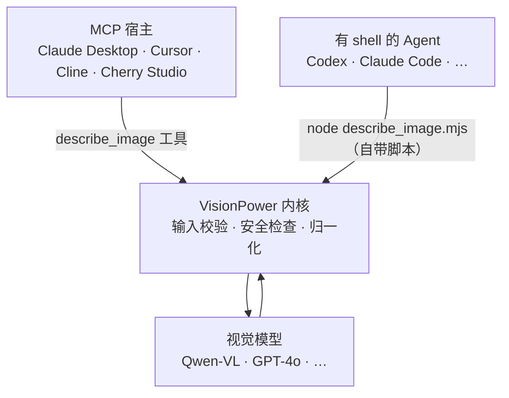

<div align="center">

# 👁️ VisionPower

**给你的 AI Agent 装上眼睛 —— 一个轻量、安全、即插即用的图片理解能力，同时支持 MCP 与 Skill 两种接入形态。**

[](./README.en.md)
[](https://www.npmjs.com/package/visionpower)
[](./LICENSE)
[](https://nodejs.org)

</div>

VisionPower 让 Codex、Claude Desktop、Cursor、Cline、Cherry Studio 等 Agent 获得**识别图片内容、读取截图文字（OCR）、解读图表、按顺序分析多张图片**的能力。

它**不绑定任何模型**：默认走阿里云百炼 / DashScope 的 Qwen-VL（OpenAI-compatible 接口），也可通过模型名和 Base URL 配置切换到 GPT-4o 或任何兼容 OpenAI `/chat/completions` 视觉输入的服务。同一套内核提供**两种接入形态**——[MCP](#作为-mcp-使用) 和 [Skill](#作为-skill-使用)，按你的 Agent 能力任选其一或都装。

---

## ✨ 特性

- 🧩 **一个能力，两种形态** —— 同一内核，既可作为 MCP 工具 `describe_image`，也可作为自包含的 Skill（一个零依赖脚本，下载即用）。
- 🖼️ **四种输入源** —— 本地路径 `image_path`、公网 `image_url`、`image_base64`、以及多图有序数组 `images[]`。
- 🔢 **多图有序分析** —— 自动标记 `Image 1 / Image 2 / …` 并要求模型按相同顺序作答。
- 🔌 **模型无关** —— 任意 OpenAI-compatible 视觉服务，改两个环境变量即可切换。
- 🔒 **安全优先** —— 路径白名单、文件 magic-byte 校验、私网/SSRF 防护、严格 base64 与输入 schema 校验。详见 [安全设计](#-安全设计)。
- 🔁 **稳健** —— 上游限流 / 5xx / 网络抖动自动重试（指数退避），超时同时覆盖响应体读取，不会卡死请求。
- 🪶 **极简依赖** —— 运行时仅依赖官方 MCP SDK 与 zod，无原生模块、无图像库。
- 🌐 **国内友好** —— 内置 npmmirror 镜像与本地安装路径，弱网也能稳定启动。

---

## 🎬 它能做什么

把图片交给 Agent，让它分析：

**输入**

```json
{
  "image_path": "/Users/me/Desktop/dashboard.png",
  "prompt": "读取这张截图里的关键数字并总结趋势。"
}
```

**输出（示例）**

```text
这是一张销售看板截图。顶部 KPI 显示本月 GMV ¥1,284,500，环比 +12.3%；
订单数 8,420，环比 +4.1%。中间折线图显示近 6 个月持续上升，3 月有一次明显回落。
右侧饼图中「华东」占比最高（38%），其次是「华南」（25%）……
```

> 📸 截图阅读、🧾 票据/表格提取、📊 图表解读、🧭 UI 走查、🐞 报错截图诊断 —— 凡是「让 Agent 看一眼图」的场景都适用。

---

## 🧭 两种形态，怎么选

两种形态**功能等价**，区别只在接入方式。按你的 Agent 能力选：

| 你的 Agent | 选哪个 | 为什么 |
| --- | --- | --- |
| Claude Desktop、Cursor、Cline、Cherry Studio（连 MCP，可能没有代码执行） | **[MCP](#作为-mcp-使用)** | 暴露结构化 `describe_image` 工具，schema 校验、调用确定 |
| Codex、Claude Code 等**有 shell / 代码执行**的 Agent | **[Skill](#作为-skill-使用)** | 运行自带的零依赖脚本，无需安装、无需常驻进程 |
| 纯聊天、无代码执行的 MCP 宿主 | **MCP** | Skill 形态没有脚本运行环境 |

> 两种可以**同时安装**。像 Codex 这种既能连 MCP 又有 shell 的 Agent，用哪种都行。

---

## 作为 MCP 使用

### 最快路径：交给 Agent 自己装

复制下面这段话发给你的 Agent（替换成你的 API Key）：

```text
请帮我安装并配置 VisionPower MCP。

我的视觉模型 API Key 是：填写你的 API Key
模型使用：qwen3-vl-flash
Base URL 使用：https://dashscope.aliyuncs.com/compatible-mode/v1

如果当前环境访问 npm 官方源稳定，请使用：
npx -y visionpower

如果访问 npm 官方源不稳定，或位于中国大陆网络环境，请优先使用：
npx -y --registry=https://registry.npmmirror.com visionpower

如果你判断 npx 启动不稳定，请先运行：
npm install -g visionpower --registry=https://registry.npmmirror.com
然后把 MCP command 配成 visionpower。

请根据当前 Agent 的配置格式写入 MCP 配置，并确认 describe_image 工具可用。
```

**准备工作**：Node.js 18+，以及一个支持视觉模型的 OpenAI-compatible API Key（阿里云百炼 Key 申请：<https://bailian.console.aliyun.com/?tab=model#/api-key>）。

### MCP JSON 配置

适用于 Claude Desktop、Cursor、Cline、Cherry Studio 等使用 JSON 配置 MCP 的工具。

```json
{
  "mcpServers": {
    "visionpower": {
      "command": "npx",
      "args": ["-y", "visionpower"],
      "env": {
        "VISIONPOWER_API_KEY": "填写你的 API Key",
        "VISIONPOWER_MODEL": "qwen3-vl-flash",
        "VISIONPOWER_BASE_URL": "https://dashscope.aliyuncs.com/compatible-mode/v1"
      }
    }
  }
}
```

<details>
<summary><b>🇨🇳 国内 npm 镜像版（弱网推荐）</b></summary>

把 `args` 换成走 npmmirror 拉取：

```json
"args": ["-y", "--registry=https://registry.npmmirror.com", "visionpower"]
```

</details>

### Codex TOML 配置

Codex 使用 TOML（不是 JSON）。写入 `~/.codex/config.toml`：

```toml
[mcp_servers."visionpower"]
type = "stdio"
command = "npx"
args = ["-y", "visionpower"]

[mcp_servers."visionpower".env]
VISIONPOWER_API_KEY = "填写你的 API Key"
VISIONPOWER_MODEL = "qwen3-vl-flash"
VISIONPOWER_BASE_URL = "https://dashscope.aliyuncs.com/compatible-mode/v1"
```

> 国内镜像把 `args` 改为 `["-y", "--registry=https://registry.npmmirror.com", "visionpower"]`。

<details>
<summary><b>先全局安装再配置（弱网 / 长期使用最稳定）</b></summary>

```bash
npm install -g visionpower   # 国内加 --registry=https://registry.npmmirror.com
```

然后把 `command` 配成本地命令 `visionpower`（`args: []`）。若 GUI 应用（Claude Desktop / Cursor）找不到命令，先 `which visionpower` 取绝对路径，再填进 `command`。

</details>

---

## 作为 Skill 使用

Skill 形态是一个**自包含、零安装、零依赖**的文件夹 [`VisionPower-Skill/`](./VisionPower-Skill)：里面有 `SKILL.md` 和一个可直接 `node` 运行的脚本 `describe_image.mjs`。**不依赖任何 CLI、不用 `npm install`**，下载这一个文件夹就能用——只需要 Node 18+ 和一个 API Key。适合 Codex、Claude Code 等**有代码执行能力**的 Agent。

> 文件夹叫 `VisionPower-Skill`（方便下载识别），但 skill 本身的名字是 `visionpower`（见 `SKILL.md` 的 `name:`）。所以安装时装到 `~/.claude/skills/visionpower/`，让安装目录名和 skill 名一致。

### 最快路径：交给 Agent 自助安装

把下面这段话发给你的 Agent，它会安装 Skill，然后**主动问你用哪个模型、并把 API Key 写进持久配置文件**：

```text
请帮我安装 VisionPower Skill。

1. 从 https://github.com/RunhuaHuang/VisionPower 获取 VisionPower-Skill 文件夹
   （git clone 整个仓库，或单独下载该文件夹）。它是自包含的，无需 npm install。

2. 把文件夹里的内容安装为名为 visionpower 的技能（Claude Code 示例）：
   mkdir -p ~/.claude/skills/visionpower
   cp VisionPower-Skill/SKILL.md VisionPower-Skill/describe_image.mjs ~/.claude/skills/visionpower/

3. 确认 Node 18+：node --version；再跑 node ~/.claude/skills/visionpower/describe_image.mjs --help 验证。

4. 然后请询问我要用哪个视觉模型（默认 qwen3-vl-flash，也可选 qwen3-vl-plus 或 gpt-4o），
   并向我要 API Key，然后帮我把它写进持久配置文件 ~/.visionpower/config.json（mode 600），
   格式 {"apiKey":"...","model":"..."}（OpenAI 再加 "baseUrl":"https://api.openai.com/v1"）。
   不要把完整 Key 回显给我。

5. 最后用一张示例图片确认 Skill 可用。成功后脚本会自动写入
   ~/.visionpower/skill-state.json（configVerified=true）；以后再调用不要重复检查配置，
   直接运行脚本。只有脚本返回缺 Key / 鉴权 / 配置错误时，才重新引导我配置。
```

### 手动安装

1. 把技能内容装为名为 `visionpower` 的技能（Claude Code 个人级示例）：

   ```bash
   mkdir -p ~/.claude/skills/visionpower
   cp VisionPower-Skill/SKILL.md VisionPower-Skill/describe_image.mjs ~/.claude/skills/visionpower/
   ```

   项目级则放到 `<你的项目>/.claude/skills/visionpower/`。其他 Agent 放进它约定的技能目录即可——即使没有自动加载机制，也可以直接让它「读取这个 SKILL.md 并按说明运行 describe_image.mjs」。

2. 确认 Node 18+，并把 API Key 写进**持久配置文件**（脚本每次运行都会自动读取，配一次永久生效）：

   ```bash
   node --version            # 需要 v18+
   mkdir -p ~/.visionpower
   cat > ~/.visionpower/config.json <<'JSON'
   { "apiKey": "填写你的 API Key", "model": "qwen3-vl-flash" }
   JSON
   chmod 600 ~/.visionpower/config.json
   ```

   > 为什么用配置文件而不是 `export VISIONPOWER_API_KEY=...`？因为 Agent 起的子 shell **通常读不到**你写在 `~/.zshrc` 里的环境变量，于是「明明配了却每次还要重配」。配置文件不受 shell 影响，最稳。环境变量仍然可用，且会覆盖配置文件。`SKILL.md` 内置「首次设置」流程：触发时若没配 Key，Agent 会主动引导你选模型、写好这个文件；成功调用后还会写入 `~/.visionpower/skill-state.json` 作为已验证开关，后续不再做配置预检，除非调用失败。

### 用起来

之后直接对 Agent 说「读一下这张截图的文字」并给出图片**绝对路径**，它会自动触发并执行（`<skill>` 为技能文件夹的绝对路径）：

```bash
node <skill>/describe_image.mjs --image-path /absolute/path/to/image.png --prompt "读取文字并总结"
```

脚本完整用法见 [接口参考 · Skill 脚本](#skill-脚本)。

---

## 🧩 工作原理



两种形态共用同一份内核逻辑（`src/vision-core.js` + `src/config.js`）：MCP server 直接引用它；Skill 的 `describe_image.mjs` 由 `npm run build:skill` 从同一份内核**自动打包**成一个零依赖脚本（测试会校验两者同步，永不漂移）。内核只做「校验 + 归一化 + 转发」，不缓存图片、不抓取 `image_url`（由上游模型服务拉取）。

---

## 🧰 接口参考

### `describe_image`（MCP 工具 / CLI 的 JSON 请求）

| 参数 | 类型 | 说明 |
| --- | --- | --- |
| `image_path` | string | 本地图片的**绝对路径**。 |
| `image_url` | string | **公网可访问**的 `http`/`https` 图片地址。 |
| `image_base64` | string | 不含 `data:` 前缀的标准 base64。 |
| `image_mime_type` | enum | `image/jpeg`、`image/png`、`image/webp`、`image/gif`、`image/bmp`，仅配合 `image_base64`；不填则自动从字节探测。 |
| `images` | array | 多图有序数组，每项是上面四个字段的组合。**不要与顶层单图字段混用。** |
| `prompt` | string | 对图片的具体问题或指令；留空则返回详尽的整体描述。 |

> `image_path` / `image_url` / `image_base64` 三选一（多图时数组内每项也是三选一）。

<details open>
<summary><b>示例：本地图片 / URL / Base64 / 多图</b></summary>

```json
{ "image_path": "/absolute/path/to/image.png", "prompt": "读取截图里的文字并总结。" }
```

```json
{ "image_url": "https://example.com/image.png", "prompt": "这张图片里有什么？" }
```

```json
{ "image_base64": "...", "image_mime_type": "image/png", "prompt": "提取所有可见文字。" }
```

```json
{
  "images": [
    { "image_path": "/absolute/path/to/first.png" },
    { "image_url": "https://example.com/second.jpg" }
  ],
  "prompt": "按顺序读取每张图片中的文字并总结。"
}
```

多图调用时，VisionPower 会按提交顺序标记 `Image 1`、`Image 2`…，并要求模型按相同顺序分段返回。

</details>

### Skill 脚本

Skill 形态用自带脚本 `describe_image.mjs`（`<skill>` 为技能文件夹绝对路径）：

```text
node <skill>/describe_image.mjs --image-path <绝对路径> [--prompt <文本>]
node <skill>/describe_image.mjs --image-url <https 地址> [--prompt <文本>]
node <skill>/describe_image.mjs request.json        # 传 JSON 请求文件
echo '<JSON 请求>' | node <skill>/describe_image.mjs # 或从 stdin 传入
```

| 选项 | 说明 |
| --- | --- |
| `--image-path <p>` | 本地图片绝对路径 |
| `--image-url <u>` | 公网 http(s) 图片地址 |
| `--image-base64 <b>` | base64 数据（大数据建议改用 JSON 文件或 stdin） |
| `--mime <type>` | 配合 `--image-base64` 的 MIME 类型 |
| `--prompt <text>` | 问题或指令（可选） |
| `--input <file>` 或位置参数 | 从文件读取 JSON 请求（结构同上表 `describe_image`） |
| `--help` | 查看帮助 |

未提供任何源参数时，脚本会从 **stdin 读取 JSON 请求**（结构与 MCP 工具完全一致，含多图 `images[]`）。结果打印到 stdout；失败时打印 `VisionPower error: <原因>` 到 stderr 并以非零码退出。

---

## 🤖 支持的模型

只要服务商兼容 OpenAI 的 `/chat/completions` 视觉输入格式，就能接入。改 `VISIONPOWER_MODEL` 和 `VISIONPOWER_BASE_URL` 两个变量即可切换。

| 服务商 | `VISIONPOWER_MODEL` | `VISIONPOWER_BASE_URL` | 说明 |
| --- | --- | --- | --- |
| 阿里云百炼 / DashScope | `qwen3-vl-flash` | `https://dashscope.aliyuncs.com/compatible-mode/v1` | **默认**，快速且性价比高。 |
| 阿里云百炼 / DashScope | `qwen3-vl-plus` | `https://dashscope.aliyuncs.com/compatible-mode/v1` | 更高质量的 Qwen-VL，取决于账号权限。 |
| 阿里云百炼 / DashScope | `qwen3.6-flash` | `https://dashscope.aliyuncs.com/compatible-mode/v1` | 账号可用该多模态模型时可直接替换。 |
| OpenAI | `gpt-4o` | `https://api.openai.com/v1` | 通用视觉理解能力强。 |
| OpenAI | `gpt-4o-mini` | `https://api.openai.com/v1` | 成本更低的 OpenAI 选项。 |
| 其他 OpenAI-compatible | 服务商提供的模型 ID | 服务商提供的 `/v1` 地址 | 把模型名和接口地址替换成你的配置即可。 |

<details>
<summary><b>OpenAI 示例（MCP env）</b></summary>

```json
"env": {
  "VISIONPOWER_API_KEY": "填写你的 API Key",
  "VISIONPOWER_MODEL": "gpt-4o",
  "VISIONPOWER_BASE_URL": "https://api.openai.com/v1"
}
```

</details>

---

## ⚙️ 配置（环境变量 / 配置文件）

两种形态共用同一套配置。优先级：**环境变量 > 配置文件 > 默认值**。

**配置文件**：`~/.visionpower/config.json`（可用 `VISIONPOWER_CONFIG` 改路径）。这是 Skill 推荐的配置方式——因为 Agent 起的子 shell 通常**读不到**你写在 shell profile 里的环境变量，而配置文件每次运行都会被自动读取，配一次永久生效。键名用 `apiKey` / `model` / `baseUrl` / `maxImages` / `timeoutMs` 等：

```json
{
  "apiKey": "填写你的 API Key",
  "model": "qwen3-vl-flash"
}
```

**环境变量**（会覆盖配置文件）：

| 名称 | 必填 | 默认值 | 说明 |
| --- | --- | --- | --- |
| `VISIONPOWER_API_KEY` | ✅ | | 视觉模型服务商的 API Key。 |
| `VISIONPOWER_MODEL` | | `qwen3-vl-flash` | 视觉模型名称。 |
| `VISIONPOWER_BASE_URL` | | `https://dashscope.aliyuncs.com/compatible-mode/v1` | OpenAI-compatible Base URL，**不要**包含 `/chat/completions`。 |
| `VISIONPOWER_ALLOWED_DIRS` | | （空 = 不限制） | 逗号分隔的允许目录白名单，`image_path` 必须落在其中。 |
| `VISIONPOWER_MAX_IMAGE_BYTES` | | `20971520` (20MB) | 单张本地/Base64 图片最大字节数。 |
| `VISIONPOWER_TIMEOUT_MS` | | `60000` | 上游接口超时时间（毫秒）。 |
| `VISIONPOWER_MAX_TOKENS` | | `2048` | 最大输出 token 数。 |
| `VISIONPOWER_MAX_IMAGES` | | `8` | 单次调用最多分析的图片数量。 |
| `VISIONPOWER_MAX_RETRIES` | | `2` | 上游 429/5xx 或网络错误时的自动重试次数（指数退避 + 抖动）。 |
| `VISIONPOWER_DEBUG` | | `false` | 设为 `true` 时向 stderr 输出请求模型、图片数与耗时等调试信息。 |
| `VISIONPOWER_SKILL_STATE` | | `~/.visionpower/skill-state.json` | 仅 Skill 脚本使用：记录配置是否已成功验证，避免后续重复预检。 |

> **命名**：主前缀是 `VISIONPOWER_*`。API Key 还可回退读取 `OPENAI_API_KEY`。

---

## 🔒 安全设计

VisionPower 在把图片交给模型前做了多层校验，适合在能读本地文件的 Agent 里使用：

- **路径白名单** —— 配置 `VISIONPOWER_ALLOWED_DIRS` 后，`image_path` 必须落在白名单目录内；先 `realpath` 解析符号链接再比对，防止软链逃逸。
- **绝对路径强制** —— 拒绝相对路径，避免歧义。
- **Magic-byte 校验** —— 本地图片会比对文件真实字节与扩展名是否一致，扩展名和内容不符直接拒绝。
- **严格 Base64 校验** —— 拒绝 `data:` 前缀、非法字符、错误填充，并做一次回编码一致性检查。
- **私网 / SSRF 防护** —— `image_url` 拦截 `localhost`、私有/保留 IPv4 段、IPv6 唯一本地/链路本地地址，以及 IPv4-mapped IPv6，并拒绝带凭据的 URL。
- **体积与数量上限** —— 单图字节数、单次图片数量、输出 token、请求超时均可配置并强制约束。
- **严格输入 schema** —— 基于 zod 校验，未知字段与字段组合冲突都会被明确拒绝。

---

## 🧪 本地开发

```bash
npm install
npm test         # 单元测试（配置解析 + 图片归一化 + 安全校验 + Skill 脚本同步校验）
npm run smoke    # 端到端：启动 MCP server 确认工具可用 + Skill 脚本拒绝空请求
npm run build:skill  # 改了内核后，重新生成 VisionPower-Skill/describe_image.mjs
npm start        # 直接以 stdio 启动 MCP server
```

源码结构：`src/vision-core.js`（内核逻辑）、`src/config.js`（配置）、`src/schema.js`（MCP 输入 schema）、`src/index.js`（MCP 出口）。Skill 出口 `VisionPower-Skill/describe_image.mjs` 由 `scripts/build-skill.mjs` 从内核自动生成（`npm test` 会校验其同步）。

---

## ❓ 常见问题

<details>
<summary><b>MCP 和 Skill 有什么区别？该装哪个？</b></summary>

功能等价，区别在接入方式：MCP 暴露结构化工具、跨 MCP 宿主通用、连无代码执行的纯聊天宿主也能用；Skill 是「一段指令 + 一个自带的零依赖脚本」，需要 Agent 有 shell/代码执行能力（如 Codex、Claude Code）。详见 [两种形态，怎么选](#-两种形态怎么选)。两种可同时安装。

</details>

<details>
<summary><b>Skill 触发了但脚本跑不起来？</b></summary>

确认装了 Node 18+（`node --version`），且用脚本的**绝对路径**调用（如 `node ~/.claude/skills/visionpower/describe_image.mjs --help`）。报「API key not configured」就按 `SKILL.md` 的「首次设置」把 Key 写进 `~/.visionpower/config.json`。若你"明明 export 了环境变量却还是不识别"，多半是 Agent 的子 shell 没继承到——改用配置文件即可。

</details>

<details>
<summary><b>第一次启动很慢 / 偶尔失败？</b></summary>

`npx` 首次运行会下载 VisionPower，之后通常走本地缓存。弱网或长期使用建议全局安装。

</details>

<details>
<summary><b>提示模型不可用 / image_path 不被允许？</b></summary>

模型可用性取决于你的服务商账号、地域和权限，换成账号下可用的视觉模型即可。`image_path` 报错通常是因为配置了 `VISIONPOWER_ALLOWED_DIRS` 而图片不在白名单内，或路径不是绝对路径。

</details>

---

## 📄 许可证

[MIT](./LICENSE) © Runhua

<div align="center">
<sub>如果 VisionPower 帮到了你，欢迎点个 ⭐ Star。</sub>
</div>
